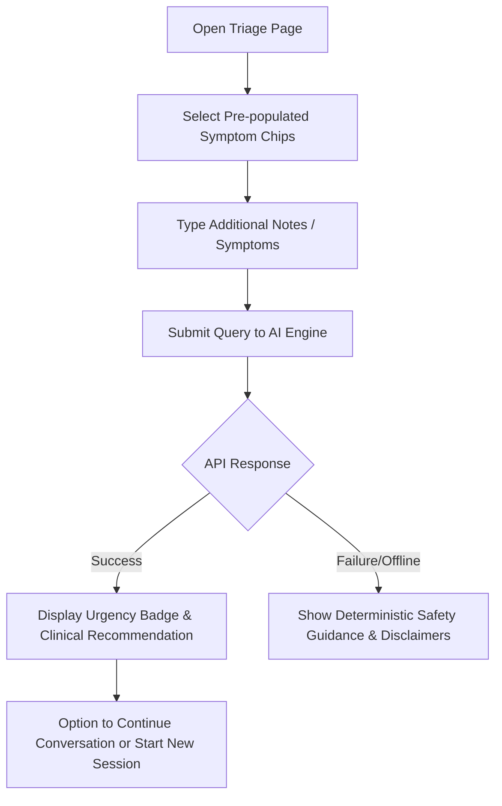
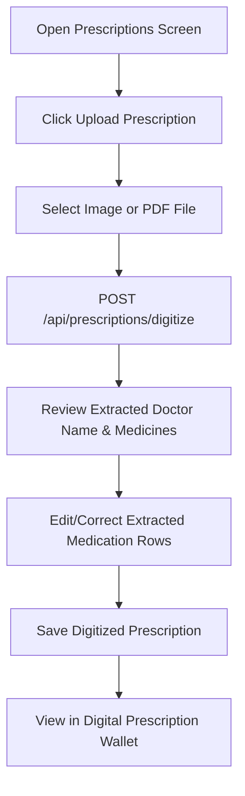
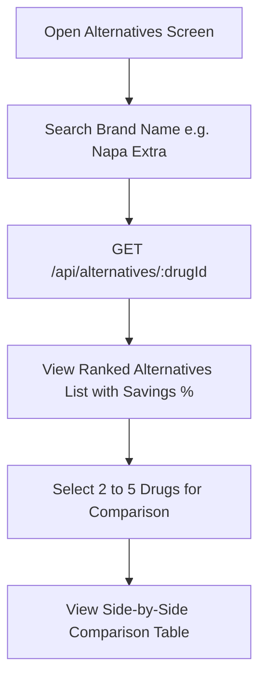
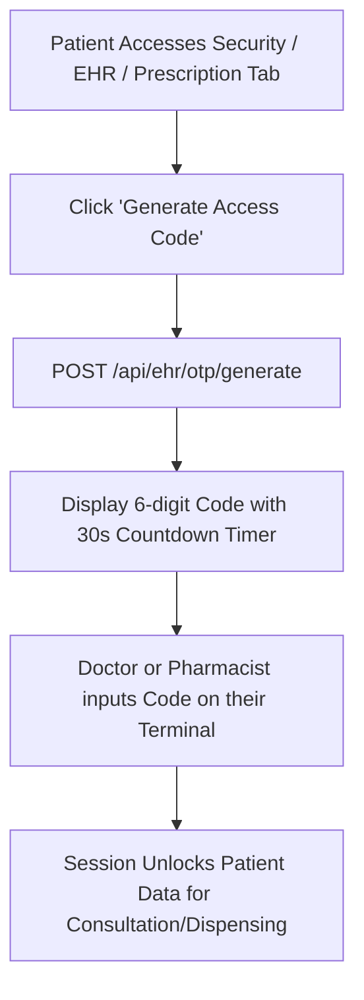
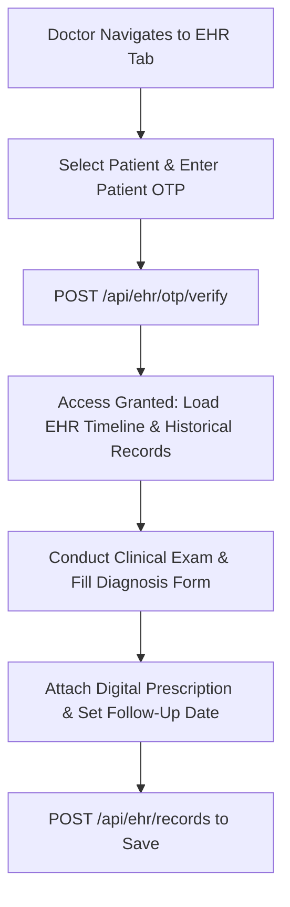
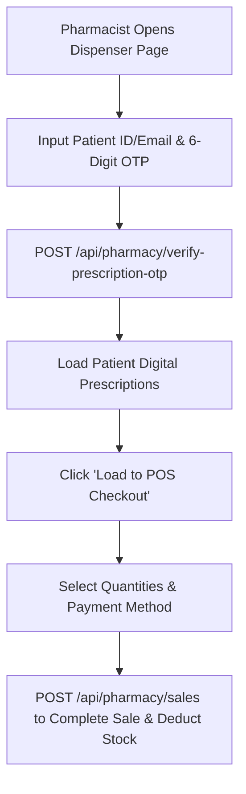

# MediSync End-to-End User Flows

---

## 1. Patient User Flows

### Flow P-1: Symptom Triage Assessment

1. Patient navigates to `/triage`.
2. Patient clicks symptom chips (e.g. "Fever", "Cough", "Chest Pain") or enters free-text symptoms in input box.
3. System sends payload to `POST /api/triage/chat`.
4. Chat feed updates with assistant message, urgency pill (`LOW` / `MEDIUM` / `HIGH` / `CRITICAL`), and recommended immediate action.
5. Conversation persists under session history in the sidebar.

---

### Flow P-2: Prescription Upload & OCR Digitization

1. Patient opens `/prescriptions` and selects "Upload Prescription".
2. File is uploaded via multipart form data (`image/jpeg`, `image/png`, `image/webp`, `application/pdf` up to 10MB).
3. Backend forwards file to OCR microservice (`/ocr/digitize`) which returns structured medicines array.
4. Patient reviews table of detected brand names, generic salt names, dosage schedules (e.g., `1+0+1`), and durations.
5. Patient can edit rows to fix OCR typos or add manual medicines.
6. Record saved into database and appears in patient's digital prescription wallet.

---

### Flow P-3: Finding Generic Medicine Alternatives & Comparing Prices

1. Patient searches for a prescribed medicine (e.g., "Napa Extra 500mg/65mg").
2. System queries `GET /api/alternatives/:drugId`.
3. Backend retrieves candidate drugs sharing identical `salt_composition`, runs deterministic scoring $(0.60 \times P_{\text{score}} + 0.40 \times Q_{\text{score}})$, and returns ranked alternatives with cost savings percentage.
4. Patient checks multi-store pharmacy availability with one tap.

---

### Flow P-4: Generating Dynamic OTP for Doctor / Pharmacy Access

1. When visiting a clinic or pharmacy, patient clicks "Generate Access OTP".
2. System executes `POST /api/ehr/otp/generate` and displays a dynamic 6-digit numeric token with active validity ring.
3. Patient shows code to provider; once verified, provider's terminal gains authorized access to records.

---

## 2. Doctor User Flows

### Flow D-1: OTP-Gated Patient EHR Review & Consultation

1. Doctor selects patient in `/patients` or enters patient UUID in `/ehr`.
2. Doctor requests patient's 6-digit OTP code and submits `POST /api/ehr/otp/verify`.
3. System verifies Speakeasy TOTP hash and unlocks medical records.
4. Doctor views past diagnoses, observations, lab history, and previous prescriptions.
5. Doctor enters new clinical notes, diagnosis, follow-up date, and submits record.

---

## 3. Pharmacy User Flows

### Flow Ph-1: Prescription Verification & Digital Dispensing

1. Pharmacist opens `/dispenser` and enters patient's email/ID and 6-digit OTP.
2. System authenticates OTP and displays patient's active prescriptions.
3. Pharmacist clicks "Dispense Items", which transfers medications into the POS checkout view (`/sales`).
4. System matches prescription medicines against pharmacy's current inventory batches.
5. Pharmacist selects payment method (Cash, Card, bKash, Nagad) and finalizes sale.
6. Stock count in `pharmacy_inventory` is atomically decremented and receipt invoice is rendered.
