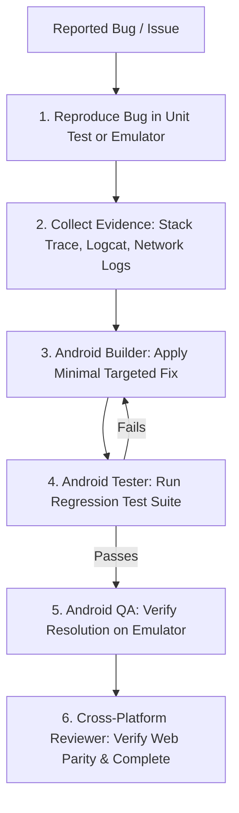

# Workflow: Autonomous Bug Fix

1. **Reproduce & Isolate:** Create a reproducing unit test or execute the exact step sequence on the emulator.
2. **Root Cause Analysis:** Inspect logs and pinpoint defect (network parser, state mutation, or UI lifecycle).
3. **Targeted Fix:** Builder modifies only affected files without altering unrelated features.
4. **Regression Verification:** Run full test suite to ensure zero collateral regressions.
