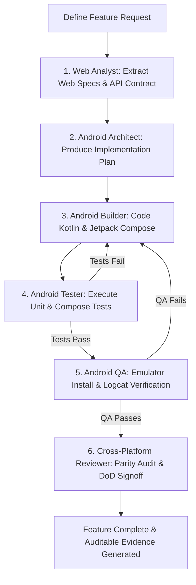

# Workflow: Autonomous Feature Development

## Stage 1: Product & API Analysis (`Web Analyst`)
- Inspects `/data/rspace/codespace/projects/medisync` for reference behavior, routes, and schemas.
- Updates `docs/product/FEATURES.md` and `docs/product/API_CONTRACT.md`.

## Stage 2: Android Architecture & Plan (`Android Architect`)
- Translates product requirements into domain models, ViewModel state, and UI navigation routes.
- Defines test cases and acceptance criteria in `docs/product/ACCEPTANCE_CRITERIA.md`.

## Stage 3: Implementation (`Android Builder`)
- Implements Kotlin models, Room/Retrofit layers, ViewModels, and Compose UI screens.
- Adheres to MediSync design tokens and handles Loading, Error, Empty, and Success states.

## Stage 4: Automated Testing (`Android Tester`)
- Executes `./gradlew testDebugUnitTest` and Compose UI tests.
- If failures occur, loops back to Android Builder with stack trace.

## Stage 5: Emulator & UI QA (`Android QA`)
- Builds APK (`./gradlew assembleDebug`), installs to connected emulator via ADB, and executes target user flow.
- Verifies Logcat has 0 crashes or ANRs and captures screenshot evidence.

## Stage 6: Cross-Platform Parity Sign-off (`Cross-Platform Reviewer`)
- Verifies full behavioral parity against the web reference and marks acceptance criteria as satisfied.
