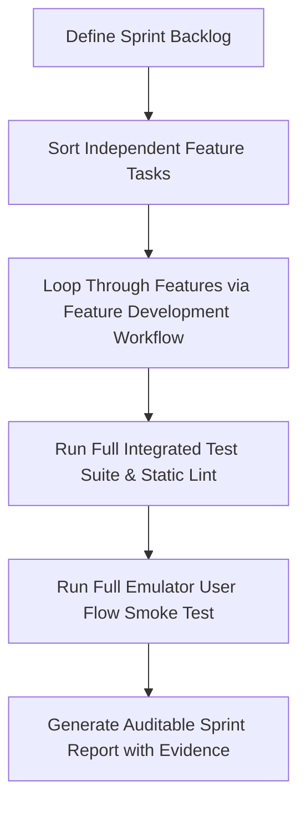

# Workflow: Autonomous Sprint Execution

1. **Backlog Prioritization:** Group independent feature modules (e.g. Auth $\rightarrow$ Triage $\rightarrow$ Prescriptions $\rightarrow$ Alternatives $\rightarrow$ OTP $\rightarrow$ Alerts).
2. **Sequential Autonomous Execution:** Run the full Feature Development workflow on each backlog item.
3. **Integration Verification:** Run full `./gradlew test` and end-to-end emulator smoke tests.
4. **Sprint Audit Report:** Produce auditable completion report documenting test counts, build outputs, and parity checks.
