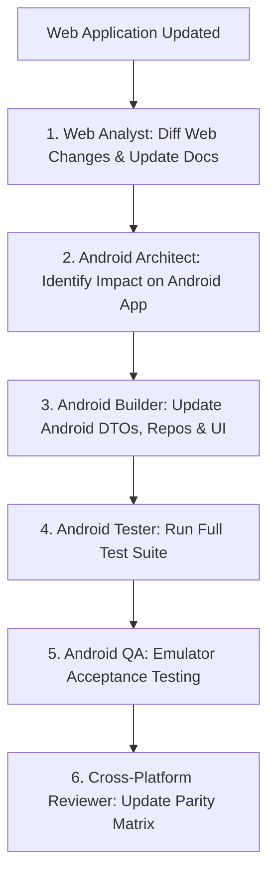

# Workflow: Web Feature Synchronization

1. **Detect Changes:** Web Analyst inspects modified web components or backend routes.
2. **Update Specs:** Update `docs/product/API_CONTRACT.md` and `docs/product/FEATURES.md`.
3. **Android Alignment:** Architect and Builder update DTOs, API endpoints, and UI views to match.
4. **Parity Sign-off:** Reviewer verifies that both platforms remain functionally synchronized.
